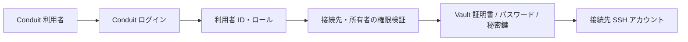

# Conduit 管理者・ユーザー分離設計

作成日: 2026-10-08。状態: 実装前の設計案。

## 1. 目的と採用方針

Conduit は、ブラウザからサーバー・ネットワーク機器へ SSH 接続し、複数端末で作業するためのソフトである。管理者は接続環境とアクセス権を管理し、ユーザーは許可された接続先で作業する。

初期構成は、同一の Go サーバー・React アプリ・オリジン上で、ユーザー画面 `/app` と管理画面 `/admin` を分離する。Conduit 自身にユーザー名・パスワードによるログインを追加する。既存の SSO 環境が未定のため、初期導入に外部 IdP を必須としない。認証処理は後から OIDC を追加できる境界を設ける。

設計で固定する判断は次のとおり。

- 保存するロールは `user` と `admin` の二つとする。
- すべての Web 接続に Conduit ログインを要求する。管理者トークン未設定による無認証許可は廃止する。
- 接続先・SSH アカウント・踏み台は管理者が登録する。ユーザーは許可された組み合わせから選択する。
- セッション、履歴、録画、個人設定には所有者を付ける。
- 管理者の全体管理権限と、SSH を操作する接続権限は区別する。管理者が他人の端末へ操作接続する機能は設けない。
- 初期版の共有は、ログインした指定ユーザーへの閲覧共有とする。匿名リンク共有は含めない。
- 認証用 Cookie、SSH セッション ID、共有 ID は別の値にする。ID を知っていることだけでアクセスを許可しない。
- SQLite を継続利用し、Web サーバーは単一インスタンスを前提とする。

## 2. 現状から変更する点

| 現在の実装 | 分離後 |
| --- | --- |
| `/api/connect` に任意の host・user・jump 情報を送信 | 登録済み `target_account_id` と今回使う認証情報を送信 |
| `ADMIN_API_TOKEN` はセッション一覧・終了だけを保護。未設定時は許可 | ログインとサーバー側のロール検証で管理 API を保護 |
| セッションの `User` は SSH ログイン名 | `OwnerUserID` と `SSHUsername` を別に保持 |
| セッショントークンが WebSocket 接続の能力を与える | 所有者検証とログインに紐づいた一回限りの接続チケットを使用 |
| 接続ログ・録画に所有者がなく、一覧 API に利用者認証がない | 所有者で検索を制限。管理者は別 API で全体を検索 |
| ブラウザにホスト・秘密鍵・最後の接続情報を保存 | サーバーの許可済み接続先を参照。ブラウザには画面配置と公開 ID を保存 |
| 共有トークン削除で新規閲覧を拒否するが、既存の閲覧は残る | 共有失効時に対象の閲覧 WebSocket も切断 |
| CLI はローカルから Vault と SSH に直接接続 | 当面は独立したクライアントとして維持。Web の権限・監査の対象外と明示 |

根拠となる主なファイル: `internal/api/handler.go`、`internal/api/admin.go`、`internal/api/connect.go`、`internal/api/terminal.go`、`internal/session/session.go`、`internal/session/manager.go`、`internal/connlog/store.go`、`frontend/src/hooks/useTabs.ts`。

## 3. 本人確認と SSH 認証の区別



例えば、Conduit 利用者 `alice` と `bob` が両方とも SSH アカウント `ubuntu` を使っても、セッション所有者と履歴は別になる。

Vault のサービス用資格情報はバックエンドだけが保持する。Conduit のパスワード、SSH のパスワード、Vault の資格情報を相互に流用しない。Web のアクセス制御は Conduit が担当し、Vault のロール・接続先 sshd の設定でも署名できる principal を制限する。

## 4. ロールと権限

共有閲覧者は独立した保存ロールではなく、ある共有セッションに対する閲覧権限を持つ `user` または `admin` である。

| 操作 | user | admin | 共有による閲覧 |
| --- | --- | --- | --- |
| 接続先を表示 | 自分に許可された接続先 | 管理画面で全件 | 共有対象の表示名のみ |
| SSH 接続を作成 | `can_connect` がある SSH アカウント | 自分への `can_connect` が必要 | 不可 |
| 自分の SSH へ入力・リサイズ・再接続 | 許可 | 許可 | 不可 |
| 他人の SSH へ入力・リサイズ | 不可 | 不可 | 不可 |
| 自分のセッション・履歴・録画を見る | 許可 | 許可 | 共有が許すライブ出力のみ |
| 全体の接続一覧・履歴を見る | 不可 | 許可 | 不可 |
| 他人の録画を見る | 不可 | 録画監査として許可し、アクセスを記録 | 不可 |
| 自分の SSH を終了 | 許可 | 許可 | 不可 |
| 他人の SSH を強制終了 | 不可 | 理由を記録して許可 | 不可 |
| 閲覧共有を作成 | 所有者かつ接続先が共有を許可 | 自分のセッションに同じ条件 | 不可 |
| 共有を取り消す | 自分が作成した共有 | 全体管理 API で許可 | 自分の閲覧を離脱できる |
| 接続先・利用者・権限・ポリシーを変更 | 不可 | 許可 | 不可 |

アクセス判定にはロール、リソース所有者、接続先の許可、利用者の有効状態を使う。リクエストの `owner_user_id` やロールを信用せず、ログイン情報から決定する。許可のない対象への取得・操作は原則 `404`、管理 API への user のアクセスは `403`、未ログインは `401` とする。[OWASP Authorization](https://cheatsheetseries.owasp.org/cheatsheets/Authorization_Cheat_Sheet.html)

## 5. 画面設計

### 5.1 共通入口

| URL | 内容 |
| --- | --- |
| `/` | ログイン状態を確認し、`/login` または `/app` に遷移 |
| `/login` | Conduit のユーザー名・パスワード入力 |
| `/account/password` | 初回のパスワード変更、本人による変更 |
| `/forbidden` | 権限不足を案内し、ユーザー画面へ戻る |

ログイン後は管理者も `/app` に入る。admin にだけ「管理画面へ」の入口を表示する。`/admin` の直打ち・画面内のボタン非表示と独立して API 側でも拒否する。

### 5.2 ユーザー画面

| URL | 主な内容 |
| --- | --- |
| `/app` | 接続先検索、お気に入り、最近使った接続先、再開できるセッション |
| `/app/workspace` | ターミナル、タブ、分割配置、接続状態、共有 |
| `/app/sessions` | 自分の接続、再開、セッション終了 |
| `/app/history` | 自分の成功・失敗・終了履歴、対象の再接続、録画再生 |
| `/app/settings` | テーマ、文字サイズ、ショートカット説明 |
| `/app/shared/:shareId` | 指定されたセッションの閲覧専用端末 |

接続先カードは表示名、環境タグ、ホスト、使える SSH アカウントを表示する。認証方式は管理者の設定から決まり、ユーザーには必要なパスワード・秘密鍵・パスフレーズだけを入力させる。Vault 接続は追加の秘密情報入力なしで開始する。

接続先がない user には「接続先が割り当てられていません」と管理者への連絡案内を表示する。初回 admin には接続先登録・権限設定への導線を表示し、管理画面から自分の接続許可も設定できる。録画する対象では接続前と端末上に「録画あり／録画中」を表示し、ユーザーが無効化できる設定と混同させない。

ワークスペースのタブ・分割・直前の出力は、履歴画面や管理画面へ移動しても維持する。画面配置は公開 ID で保存し、復元時にサーバーへ所有権と生存状態を確認する。ユーザー切り替え時には旧利用者の配置・端末出力を消す。

「接続を残してタブを閉じる」と「SSH セッションを終了する」を区別する。再接続中、再接続猶予、終了、認証失効を別表示にする。再接続期限はサーバーの最新値を使用する。Vault 証明書期限、Conduit ログイン期限、SSH アイドル期限を同じ期限として表示しない。

### 5.3 管理画面

| URL | 主な内容 |
| --- | --- |
| `/admin` | 接続数、利用者数、失敗傾向、Vault 連携・録画・DB の状態 |
| `/admin/users` | 利用者作成、無効化、ロール変更、一時パスワード発行 |
| `/admin/targets` | 接続先・SSH アカウント・踏み台・環境タグの登録 |
| `/admin/access` | 利用者と接続先のアクセス権設定 |
| `/admin/sessions` | 所有者、接続先、接続状態、共有者数、理由付き強制終了 |
| `/admin/logs` | 全体の接続ログ、失敗、管理操作、録画の監査 |
| `/admin/settings` | 運用ポリシーとデプロイ設定の確認 |

通常の操作に不要なトークン、DB の内部パス、Vault トークン、秘密鍵を表示しない。強制終了・利用者無効化では対象と影響件数を表示する。

初期版で変更可能な運用ポリシーは、SSH アイドル期限、再接続猶予、ログイン期限、共有最大期限、録画の有効化・保存期間とする。値に上下限を設ける。Vault の接続資格情報、既知ホスト鍵ファイル、録画ディレクトリ、DB パス、公開 URL はデプロイ設定で管理し、画面には設定済みかどうかを表示する。

## 6. ログイン認証

### 6.1 ローカルアカウント

自己登録は設けず、管理者がアカウントを作成する。初回管理者はサーバーの管理コマンドで作成し、一時パスワードは標準入力などで受け取る。初期パスワード変更前は、本人情報・パスワード変更・ログアウトだけを許可する。

パスワードは Argon2id と利用者ごとのランダム salt でハッシュ化する。初期パラメータはメモリ 19 MiB、反復 2、並列度 1 を下限とし、デプロイ環境で応答時間を測定して調整する。保存形式にはアルゴリズム・パラメータを含め、ログイン時に再ハッシュできるようにする。ログイン試行は送信元と正規化したアカウント名単位で制限する。[OWASP Password Storage](https://cheatsheetseries.owasp.org/cheatsheets/Password_Storage_Cheat_Sheet.html)

ログイン成功時はランダムなログインセッションを発行し、DB にはトークンのハッシュを保存する。Cookie は `__Host-conduit_session; Secure; HttpOnly; SameSite=Lax; Path=/` を使用する。ブラウザの localStorage にはログイン資格情報を保存しない。開発環境は HTTPS を優先し、HTTP 用の明示的なローカル設定を本番設定と分離する。[OWASP Session Management](https://cheatsheetseries.owasp.org/cheatsheets/Session_Management_Cheat_Sheet.html)

ログイン期限の初期案は絶対期限 8 時間、利用がない場合の期限 60 分。ターミナルからの有効な入力や認証済みの操作を活動として扱い、バックグラウンドの一覧更新・heartbeat・SSH の出力だけでは期限を延ばさない。これらの期限は SSH のアイドル期限とは別に検証する。

期限前には端末外の通知で再ログインを案内する。認証が失効しても最後の端末出力を消さず、本人の再ログイン後に所有セッションの生存を確認する。別の利用者でログインした場合には旧出力を消す。

Cookie を使う変更 API には CSRF トークンと Origin 検証を適用する。ログインも login CSRF を防ぎ、匿名の同一オリジン要求で取得した短命 CSRF トークンを必要とする。ログイン時に CSRF トークンを更新する。初期構成では別オリジンからの管理・ユーザー API 呼び出しを許可しない。

### 6.2 ログアウトと権限変更

- 明示ログアウト時は、当該ログインと未使用チケットを失効し、そのログインの WebSocket を閉じ、そこから作成した共有を取り消す。最後の所有者接続が離れた SSH は再接続猶予に移り、同じ利用者が再ログインすれば再開できる。画面には「接続は最大 15 分残ります」と現在の猶予値を案内する。
- 「自分の SSH をすべて終了してログアウト」も用意する。この操作は他端末で使っている自分の SSH も終了するため、対象件数を表示する。通常のログアウトで他端末の有効ログインや操作接続は失効しない。
- ログイン期限到達時は当該ログインに紐づく WebSocket を切断し、再ログインを案内する。SSH は所有者の再接続猶予に移る。共有は作成元ログインが失効した時点で取り消す。
- 利用者無効化・パスワードリセット時は全ログインを失効し、その利用者の SSH・共有を終了する。
- ロール変更時は全ログインを失効し、再ログインを要求する。既存の管理画面・WebSocket に旧権限を残さない。
- 最後の有効な admin の無効化・降格は拒否する。復旧用のパスワードリセットはサーバー管理コマンドを用意する。

### 6.3 将来の OIDC

ログイン検証を `Authenticator` 境界に置き、認証成功後のユーザー・ロール・Cookie・権限処理は共有する。OIDC を追加する際は `(issuer, subject)` をユーザーに紐づけ、メールアドレス一致だけで既存アカウントを結合しない。管理者ロールは Conduit 側で明示的に付与する。OIDC のプロバイダ選択・MFA・アカウント同期は別設計とする。

## 7. 接続先と認証情報

接続は以下のモデルで管理する。

```text
接続先 target
  ├─ 表示名・host・port・環境タグ・有効状態
  ├─ 固定の踏み台設定（任意、初期版は 1 段）
  └─ SSH アカウント target_account
       ├─ SSH ログイン名
       ├─ 認証方式 vault / password / pubkey
       ├─ 録画・共有ポリシー
       └─ 利用者への access_grant
```

`access_grant` はアカウント単位で `can_connect` と `can_view_shared` を持つ。例えば「ubuntu で接続可能」と「root で接続可能」を別に許可する。閲覧だけを許可されたユーザーは、鍵を持たずに指定共有へ参加できる。

API はブラウザから host、port、SSH ログイン名、踏み台設定、Vault ロールの上書きを受け付けない。選ばれた公開アカウント ID を使い、サーバーの登録情報から接続要求を組み立てる。

踏み台の通過は管理者が対象接続先に設定した経路として許可する。この許可で踏み台自体への対話 SSH 接続を許可しない。直接接続には別の接続先登録と grant が必要である。踏み台の循環・2 段以上・未許可経路は初期版で拒否する。

パスワード、秘密鍵、パスフレーズは今回の接続に必要なものだけをブラウザのメモリから HTTPS で送る。バックエンドでは接続確立後に破棄し、履歴・監査・プロファイルへ保存しない。認証方式の自動フォールバックはせず、失敗時は利用者に方法を選び直させる。秘密鍵の永続保存や共通パスワード管理は初期版に含めない。

接続先の新規登録・変更時は、管理者が設定したネットワーク範囲とホスト鍵検証設定を確認する。ループバック、リンクローカル、メタデータサービスなどへの接続は既定で禁止する。DNS 名はダイヤル時に検証した IP に接続し、踏み台経由は踏み台側の到達先制限と併用する。ネットワーク機器やプライベートアドレスは利用対象なので、組織の許可範囲として登録する。

## 8. データ設計

### 8.1 SQLite の永続データ

| テーブル | 主なフィールド・制約 |
| --- | --- |
| `users` | `id`, `login_name_normalized UNIQUE`, `display_name`, `role`, `status`, `password_hash`, `must_change_password`, `auth_version`, timestamps |
| `login_sessions` | `token_hash UNIQUE`, `user_id`, `auth_version`, `csrf_secret`, `created_at`, `last_activity_at`, `idle_expires_at`, `absolute_expires_at`, `revoked_at` |
| `targets` | `id`, `name`, `host`, `port`, `environment`, `enabled`, `jump_account_id NULL`, `revision`, timestamps |
| `target_accounts` | `id`, `target_id`, `ssh_username`, `auth_type`, `enabled`, `sharing_enabled`, `recording_enabled`, `revision`; `(target_id, ssh_username)` を一意化 |
| `access_grants` | `user_id`, `target_account_id`, `can_connect`, `can_view_shared`; 組み合わせを一意化 |
| `ssh_session_records` | `id`, `owner_user_id`, `target_account_id`, `host_snapshot`, `ssh_username_snapshot`, `state`, `started_at`, `ended_at`, `ended_reason` |
| `connection_logs` | 既存項目に `owner_user_id NULL`, `target_account_id NULL`, `session_id NULL`, `failure_code` を追加 |
| `shares` | `id`, `session_id`, `created_by_user_id`, `created_login_session_hash`, `expires_at`, `revoked_at` |
| `share_recipients` | `share_id`, `user_id`; 組み合わせを一意化 |
| `user_preferences` | `user_id UNIQUE`, `theme`, `font_size`, `favorite_account_ids`, `updated_at` |
| `audit_events` | `id`, `actor_user_id NULL`, `action`, `resource_type`, `resource_id`, `reason`, `result`, `created_at`, `request_id`; アプリからは追記のみ |
| `operation_policies` | ログイン・SSH・共有・録画の期限、有効状態、`revision`, `updated_by`, `updated_at` |
| `schema_migrations` | 適用したスキーマ版・適用日時 |

参照整合性とインデックスを設ける。所有者＋日時、対象アカウント＋日時、共有期限、ログイン期限の検索を想定する。新規データには所有者を必須とし、旧ログだけ NULL を許可する。利用者・接続先は物理削除より無効化を基本にして監査履歴を保持する。

ユーザーのログ一覧は SQL の `WHERE owner_user_id = ?` で絞り、ページングする。全ログを読み出してブラウザで隠す方法は使わない。録画は対象ログを所有者付きで直接取得して認可する。`recording_path` は API の応答から除外する。

Web のユーザー管理には永続 DB を必須とする。既存の件数だけによる 200 行の自動削除を、接続履歴の期間・容量ポリシーへ置き換える。管理操作の監査は接続履歴と別に保持し、初期案は接続ログ 90 日、監査 180 日、録画 30 日・10 GiB とする。録画削除はログ表示と整合させ、接続履歴削除で録画が孤立しないようにする。

### 8.2 インメモリのライブデータ

SSH クライアント、PTY、WebSocket、出力バッファ、接続チケットはメモリに保持する。既存 `session.Session` に公開 `ID`、`OwnerUserID`、`TargetAccountID`、検証した権限・対象リビジョンを追加する。DB の SSH 記録は接続ハンドルを再現するためのものではない。

サーバー再起動後は生きていた記録を `terminated / server_restart` に更新し、画面では「前の接続は終了しました」と表示する。再起動後の PTY 継続は保証しない。

接続先・SSH アカウントの無効化では、その対象の進行中接続をキャンセルし、該当ライブセッションと共有を終了する。`can_connect` の取消は、その利用者が当該アカウントで所有する接続だけに適用する。`can_view_shared` の取消は、その利用者の該当閲覧チケット・閲覧 WebSocket を失効させ、ほかの所有者の SSH は終了しない。

接続中は権限を再確認してから登録し、権限変更イベントと登録を調停して、取り消し直後に古い権限の接続が残る競合を防ぐ。ホストや SSH アカウントの変更も旧セッションを終了してから新設定を適用する。

## 9. API 設計

管理・ユーザー API は `/api/admin` と `/api/app` に分ける。JSON に表示用 ID を返し、既存の SSH セッショントークンを認可手段として返さない。

| メソッド・パス | 条件・用途 |
| --- | --- |
| `GET /api/auth/csrf` | 同一オリジン。未ログイン用またはログイン用 CSRF トークン取得 |
| `POST /api/auth/login` | ローカル本人確認、レート制限、Cookie 発行 |
| `POST /api/auth/logout` | ログインと CSRF 検証。当該ログイン失効、必要に応じ `terminate_owned_sessions=true` で自分の全 SSH 終了 |
| `GET /api/auth/me` | ログイン中の ID・表示名・role・期限・変更必須状態 |
| `POST /api/auth/password` | 現パスワード検証、変更、他ログインの失効 |
| `GET /api/app/targets` | 自分に許可された接続先・アカウント・ポリシー |
| `POST /api/app/sessions` | `target_account_id` の `can_connect` 検証後に SSH 接続 |
| `GET /api/app/sessions` | 自分の生存セッションと最新の再接続期限 |
| `GET /api/app/sessions/{id}` | 所有者検証後に接続状態取得 |
| `DELETE /api/app/sessions/{id}` | 所有者検証後に SSH 終了 |
| `POST /api/app/sessions/{id}/ws-ticket` | 所有者・現在の接続権限検証後に操作チケット発行 |
| `GET /api/app/logs?cursor=...` | 自分の接続履歴、失敗情報、録画メタデータ |
| `GET /api/app/recordings/{logId}` | 自分の録画を認可して配信 |
| `GET/PATCH /api/app/preferences` | 自分の個人設定 |
| `GET /api/app/sessions/{id}/share-candidates` | 所有者検証後に、共有可能な利用者を取得 |
| `POST /api/app/sessions/{id}/shares` | 所有者・対象ポリシー・宛先検証後に共有作成 |
| `GET /api/app/sessions/{id}/shares` | 所有者が自分の共有を確認 |
| `DELETE /api/app/sessions/{id}/shares/{shareId}` | 所有者・共有の所属検証後に失効 |
| `GET /api/app/shared/{shareId}` | 指定閲覧者または作成者として共有概要取得 |
| `POST /api/app/shared/{shareId}/ws-ticket` | 指定閲覧者・現在の閲覧許可を検証し閲覧チケット発行 |
| `GET/POST /api/admin/users` | admin による一覧取得・利用者作成 |
| `GET/PATCH /api/admin/users/{id}` | admin による利用者取得・更新・無効化 |
| `POST /api/admin/users/{id}/reset-password` | 一時パスワードを発行し、ログイン・SSH・共有を失効 |
| `GET/POST /api/admin/targets` | admin による接続先一覧取得・作成 |
| `GET/PATCH /api/admin/targets/{id}` | admin による接続先取得・更新・無効化 |
| `GET/POST /api/admin/targets/{id}/accounts` | SSH アカウント一覧取得・作成 |
| `GET/PATCH /api/admin/targets/{id}/accounts/{accountId}` | 所属確認後に SSH アカウント取得・更新・無効化 |
| `GET /api/admin/access-grants` | アクセス権一覧取得 |
| `PUT/DELETE /api/admin/users/{userId}/access-grants/{accountId}` | 利用者＋アカウントを指定して権限付与・取消 |
| `GET /api/admin/sessions` | 全体の接続メタデータ |
| `DELETE /api/admin/sessions/{id}` | 理由必須の強制終了 |
| `DELETE /api/admin/shares/{shareId}` | 理由付きで共有を停止 |
| `GET /api/admin/logs` | 全体の接続履歴 |
| `GET /api/admin/recordings/{logId}` | 録画監査として配信し、閲覧イベントを記録 |
| `GET /api/admin/audit-events` | 管理操作・録画アクセス等の監査 |
| `GET/PATCH /api/admin/settings` | 運用ポリシー。リビジョンで更新競合を検出 |
| `GET /api/admin/health` | 管理者用の依存サービス状態、秘密情報を除外 |
| `GET /healthz` | 認証不要の最小 liveness。利用者・接続先の情報を返さない |

接続作成例:

```json
{
  "target_account_id": "account_public_id",
  "credentials": { "password": "今回だけ使用する値" },
  "jump_credentials": {}
}
```

認証方式が Vault の場合は `credentials` を省略する。未知フィールド・設定された認証方式と合わない資格情報は拒否する。レスポンスは `session_id`、接続先表示情報、`state`、必要なときの `reconnect_deadline` を返す。作成成功は `201`、対象が無効なら `409 TARGET_DISABLED`、許可のない ID は `404`。接続失敗は利用者向け分類を返し、詳細は所有者の接続ログへ保存する。

一覧には件数上限と cursor を設定する。認証・利用者情報・チケット・共有・ログ・録画には `Cache-Control: no-store` を付ける。ロール・リソース認可はルーティングとサービス層で検証し、依存するすべての経路に適用する。

利用者・接続先・grant・ポリシーの変更と監査イベントの記録は同じ DB トランザクションで確定する。強制終了の操作理由と録画アクセスも追跡可能にする。ログストアの新しい読み書き API はエラーを返し、保存に失敗した接続を正常作成として返さない。接続確立後に登録できなければ SSH を閉じ、利用者へ `503 STORAGE_UNAVAILABLE` を返す。

本人の通常のパスワード変更では現パスワードを確認し、当該ログインを新しい Cookie に更新して他ログインを失効する。旧ログインに紐づく WebSocket・未使用チケット・共有はすべて失効し、SSH は再接続猶予に移る。新しい Cookie で本人の接続を再開できるようにする。管理者によるリセット・利用者無効化とは別の操作として扱う。

## 10. WebSocket と共有

### 10.1 操作接続

1. ログインした利用者が `POST .../ws-ticket` を送る。
2. 所有者・対象権限・ログイン有効状態を検証し、ランダム 256 bit のチケットを発行する。
3. チケットのハッシュ、利用者 ID、ログインセッション、SSH ID、接続種別、有効期限 30 秒をメモリに保存する。
4. ブラウザは同一オリジンの `wss://.../ws?ticket=...` に Cookie とチケットを送る。
5. Origin、Cookie、ログイン、現在の対象権限、チケットの対応関係を upgrade 前に検証し、チケットを一回限りで消費する。
6. 接続登録と権限失効を調停する。長寿命の接続にも、認証期限・権限失効を反映する。

チケットは失敗した upgrade でも再利用できず、再試行時に再発行する。URL の query はプロキシを含むアクセスログで除外・マスクする。既存のフルセッショントークン出力は廃止する。ブラウザ用 `/ws` では空 Origin と未許可 Origin を拒否する。開発用 localhost と本番公開 URL は明示許可する。[OWASP WebSocket Security](https://cheatsheetseries.owasp.org/cheatsheets/WebSocket_Security_Cheat_Sheet.html)

### 10.2 共有接続

作成者は対象アカウントに `can_view_shared` を持つ有効ユーザーから宛先を選ぶ。共有最大期限の初期案は 1 時間。共有ページには作成者、対象、閲覧専用、期限、所有者の接続状態を表示する。

共有リンクは `/app/shared/{share_id}` とし、秘密トークンを含めない。リンクを転送されても、ログインした指定ユーザーでなければ閲覧できない。作成者も概要を確認できるが、他人の操作チケットを取得できない。

共有チケットには `share_id` と `read_only` を固定する。stdin、PTY リサイズ、共有作成、録画、他のセッション取得を許可しない。共有の取消・期限切れ・宛先の無効化・閲覧 grant の取消・SSH 終了・作成元ログイン失効で、対象閲覧 WebSocket を即座に閉じる。共有の失効は所有者の SSH 操作接続を閉じない。

再接続猶予は最後の所有者の操作接続が離れた時点から数える。閲覧者だけが残っても猶予を延長しない。猶予内のライブ閲覧は共有が有効である限り継続でき、期限到達で SSH と閲覧を終了する。

## 11. サーバー構成と変更箇所

```text
internal/auth/        ローカル本人確認、Cookie、CSRF、ログイン失効
internal/identity/    利用者・ロール・アカウント状態
internal/access/      操作ごとの所有者・対象・共有権限検証
internal/target/      接続先・SSH アカウント・固定踏み台
internal/database/    SQLite 接続、トランザクション、バージョン付き migration
internal/audit/       管理操作と録画アクセスの追記
internal/api/         auth・app・admin ごとのルートと DTO
internal/session/     所有者付き SSH と共有、失効通知、接続チケット
internal/connlog/     所有者を使う検索・直接取得・保持期間
frontend/src/auth/    ログイン状態、画面ガード、CSRF 対応 fetch
frontend/src/layouts/ UserLayout・AdminLayout
frontend/src/pages/   Login・ユーザー画面・管理画面
```

SSH dialer、Vault クライアント、PTY、録画の低レベル機能は継続利用する。`Handler` が直接すべてを処理する形から、認可を含むサービスを呼び出す形へ移す。

`SessionList` は「自分のセッション」と「管理者の全体一覧」に分ける。`LogPage` は所有者別 API と管理者 API を使い、録画の配信元にも同じ認可を適用する。`TerminalPool` はワークスペースの親に置き、画面移動で端末を破棄しない。ルーティング用ライブラリの採用は実装時に現行 React/Vite との適合を確認する。

管理画面の HTML や JS 自体が取得できることと、管理データを利用できることは区別する。秘密情報を静的ファイルへ含めず、サーバーを最終的な権限判定の場所とする。

## 12. 導入・移行

1. **永続化の準備**: DB・録画をバックアップし、`DB_PATH` と永続ボリュームを必須化する。既存 DB にバージョン付き migration を適用する。
2. **利用者準備**: 管理コマンドで初回 admin を作成し、ユーザー、接続先、SSH アカウント、grant を登録する。旧プロファイルは管理者の確認を経て接続先として取り込む。
3. **認証・認可を含む新 API と画面を実装**: 保護を一部だけ適用した状態で公開しない。匿名アクセス、任意 host 接続、旧トークン接続を拒否する切替を一度のリリースで行う。
4. **切替時の終了**: メンテナンスを告知し、所有者のない既存 SSH と匿名共有を終了する。既存ブラウザの旧セッショントークンは復元しない。
5. **旧ログ・録画**: 所有者が不明な旧ログは `owner_user_id = NULL` とし、管理者の旧履歴にだけ表示する。SSH 名だけを根拠に新しい利用者へ割り当てない。
6. **旧ブラウザデータ**: 旧ホスト情報は接続要求に使わず、管理者への取込候補とする。旧鍵保存・旧トークンを利用する自動接続を停止し、旧データ消去の案内と処理を用意する。
7. **運用確認**: HTTPS、Cookie、Origin、CSRF、権限取消、録画認可、バックアップ・復元、管理者復旧を確認して利用開始する。

旧 API `/api/connect`、`/api/sessions/{token}`、`/api/logs`、`/api/recordings/{id}`、`/ws?token=`、`/ws?share=` は切替時に廃止する。必要な移行案内は `410 Gone` とし、無認証の互換ルートは残さない。`ADMIN_API_TOKEN` は人のログインとして使わない。

Docker Compose では DB と録画を永続マウントする。Nginx の SPA fallback で `/app` と `/admin` を配信し、API・WebSocket は同一オリジンへプロキシする。公開 URL は信頼されたデプロイ設定から決定し、リクエストの Host や任意の転送ヘッダーから共有 URL を組み立てない。

CLI は現在 Conduit サーバーを経由せず Vault と SSH に接続する。この設計のアクセス制御・録画・監査で CLI まで管理できるとは扱わない。CLI の接続権限も統一する要件が生じた場合は、サーバー経由の認証・接続方式を別途設計する。

## 13. 実装の分割と完了条件

| 段階 | 実装内容 | 完了条件 |
| --- | --- | --- |
| A | DB migration、利用者、初回 admin、ログイン、CSRF | ローカル本人確認・失効・最終 admin 保護が動作 |
| B | 接続先・SSH アカウント・grant、所有者、app/admin API、WS チケット | user 間の分離と管理権限、任意接続の拒否を検証 |
| C | `/app`・`/admin`、検索・接続・復元・自分の履歴、管理 CRUD | 利用者が許可接続先へ接続し、管理者が全体を管理可能 |
| D | 指定閲覧共有、録画認可・監査、保持期間、権限変更とライブ失効 | HTTP と既存 WebSocket の両方で取消が反映 |
| E | 切替・移行案内、永続マウント、復旧・負荷確認 | 旧経路を閉じた状態で通しの受け入れ試験に成功 |

初回公開は A〜E が完了したまとまりとする。開発用に個別段階をマージできても、旧経路が残る状態で複数ユーザーへ提供しない。

主要な受け入れ試験:

- Alice と Bob が同じ SSH アカウントを使っても、セッション・履歴・録画が混ざらない。
- user が管理 URL、管理 API、他人の公開 ID、他人の録画 URL を直接指定してもアクセスできない。
- admin は全体メタデータと録画監査にアクセスできるが、他人の操作 WebSocket は取得できない。
- 許可のない SSH アカウントや、body で上書きした host・user・jump 設定では接続できない。
- 踏み台の通過許可だけで、その踏み台へ対話 SSH を開始できない。
- 接続中に grant を取り消しても、完了後に古い権限の SSH が登録されない。
- Cookie や WS チケットが漏れても、チケットだけでは別ログインから接続できず、再利用・期限切れを拒否する。
- ログアウト、ログイン期限、無効化、ロール変更の影響が既存 WebSocket に反映される。
- 指定外の利用者は共有リンクを転送されても閲覧できず、指定閲覧者も stdin・resize を送れない。
- 共有停止・期限到達で既存閲覧も閉じ、所有者の接続は維持される。
- ページ再読み込みで所有する複数タブと配置を復元し、別利用者の端末出力を表示しない。
- 通常ログアウトはそのログインのアクセスを失効して共有を停止する。通常のタブ閉鎖と同様に SSH は再接続猶予を持ち、「すべて終了してログアウト」では自分の全 SSH が終了する。
- サーバー再起動、旧ログの移行、録画保存上限、管理者パスワード復旧で状態が整合する。
- `go test`、race detector、フロントのテスト・ビルド、HTTPS 上のブラウザ通し操作を実施する。

## 14. 初期版に含めない拡張

SSO/OIDC、外部匿名閲覧、グループによる権限付与、SSH 秘密鍵・共通パスワードの永続保管、MFA、複数サーバーへの水平分散、サーバー再起動を越える PTY 継続、CLI の統合管理は別フェーズとする。初期モデルはこれらを後から追加できる ID とサービス境界を持つ。

ユーザー別の接続先設定と管理者の全体管理が必要な現状では、最初に所有者・接続先権限・認証失効を通した一つの経路を完成させる。
